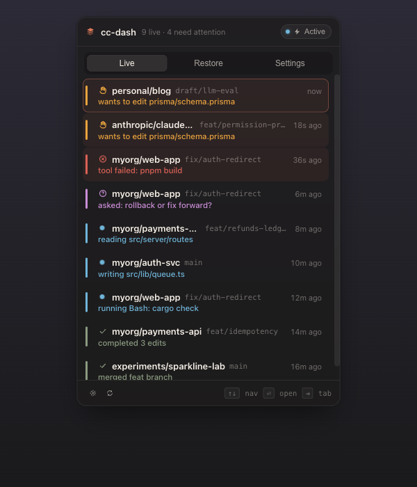
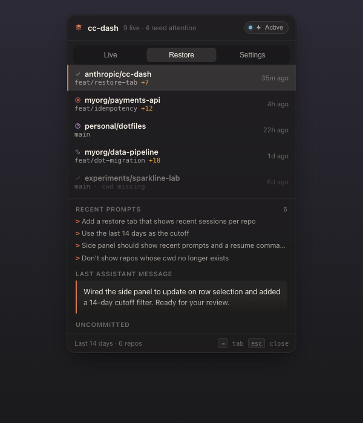
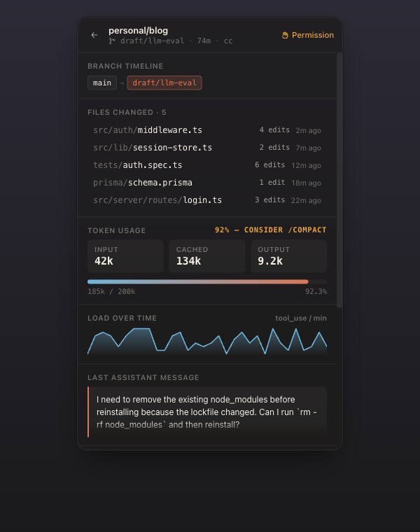
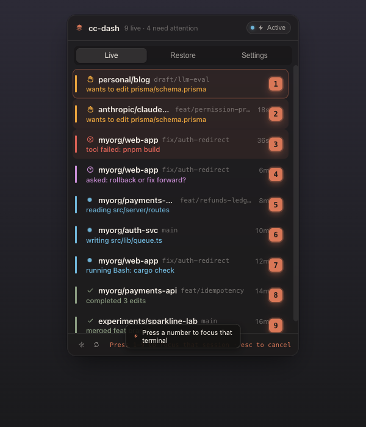
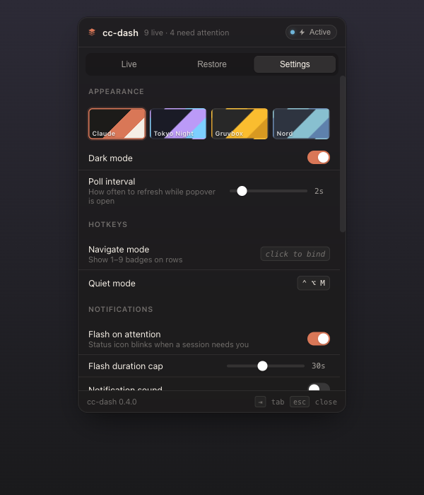

# cc-dashboard

A macOS menu-bar inbox for your `claude` sessions.

## Why

If you run `claude` across more than one project, you've probably done this:

> Where was that session waiting on me? Which terminal? Which Space?

cc-dashboard puts every running session in your menu bar. One glance shows
what needs you, what's still working, and what you forgot to close.

## What it surfaces

For every live `claude` session on your machine:

- **Status** — waiting on permission, asking you, working, idle, or done
- **Last user prompt** + **last assistant turn**
- **Active tool** (if any), **repo**, **branch**, **dirty/clean**, **idle time**

If you closed a terminal but `claude` kept running, cc-dashboard still finds it.

---

## Live — your inbox



Sessions are ranked by what needs you most:
**permission pending → tool failed → asking you → idle → working**.
Click a row to focus the Ghostty window where that session lives.

## Restore — pick up where you left off



The 14 most recent projects, even ones you've quit. One click copies
`claude --resume <sid>` to your clipboard, or opens the project in your IDE.

## Session detail — depth on one screen



Click a row to expand: token usage with sparkline, files changed, branch
history, and a Decision Log of your "should I X?" / Claude's "yes, because Y"
pairs.

## Navigate mode — keyboard-first jump



Bind a global hotkey in Settings. Press it from anywhere on macOS, then hit
`1`–`9` to jump straight to that session. No mouse, no Mission Control.

## Settings



Theme, hotkeys, and Quiet mode (suppresses the menubar flash + OS notifications
when you don't want to be interrupted).

---

## Build

Requires macOS 14+, Xcode 15+ command-line tools, `xcodegen`, and `bun`:

```bash
brew install xcodegen oven-sh/bun/bun
make app-build && make app-run
```

The first time you click a session row, macOS will ask for **Accessibility**
permission — cc-dashboard reads window titles to pick the right Ghostty
window. That's all it's used for.

## More

- [Architecture & internals](docs/architecture.md) — how the matcher works,
  data sources, sidecar IPC, full keyboard-shortcut reference.
- [docs/screenshots/README.md](docs/screenshots/README.md) — for refreshing
  the images on this page.

## License

[MIT](LICENSE). Bundles a small subset of
[sindresorhus/KeyboardShortcuts](https://github.com/sindresorhus/KeyboardShortcuts)
(also MIT) — see [LICENSE-VENDORED.md](LICENSE-VENDORED.md).
